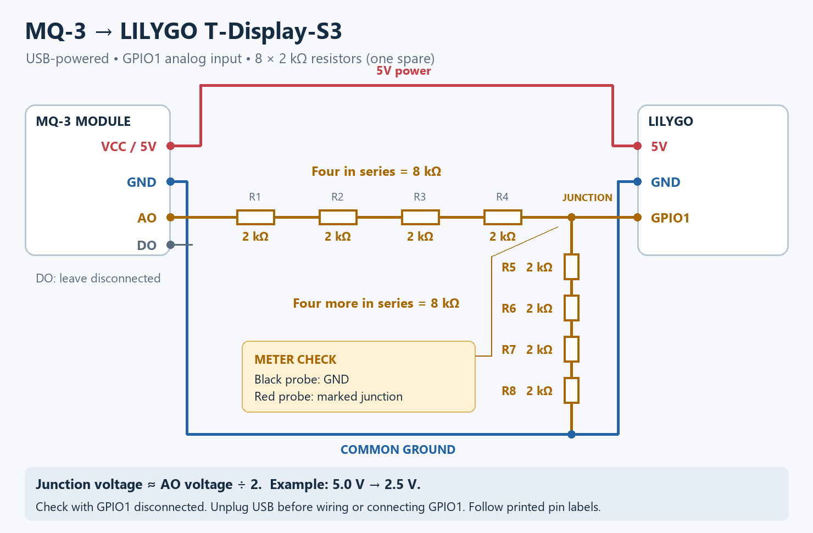

# MQ-3 wiring and clean-air bench test

The ACEIRMC module's listing specifies **5 V VCC**, GND, AO (analog output) and DO (threshold output). We want **AO**, since DO only indicates whether a threshold was crossed. Follow the labels on your actual board, not an assumed header order. [Module listing](https://www.amazon.com/dp/B0978KZQVY)



Dots mark electrical connections; wire crossings without dots are not connected. This is a logical wiring diagram, not physical header order.

## USB-powered wiring

Power off before wiring. The user has nine 2 kΩ resistors. Use **eight of them**: four in series form the upper 8 kΩ resistance, and four more in series form the lower 8 kΩ resistance. One resistor remains spare. This gives the same 1:2 voltage division as the previously proposed pair of 10 kΩ resistors.

| Module | Connection |
| --- | --- |
| VCC | LILYGO **5V** pin while powered by USB |
| GND | LILYGO **GND** |
| AO | Through the divider below to **GPIO1** |
| DO | Leave disconnected |

```text
MQ-3 AO -- 2k -- 2k -- 2k -- 2k --+-- GPIO1 (ADC1_CH0)
                                 |
                                 +-- 2k -- 2k -- 2k -- 2k -- GND
```

Equal resistor values halve the analog voltage: a 5 V module output becomes 2.5 V at GPIO1. **Do not connect AO directly to an ESP32 input.** Configure that ADC input for its widest attenuation range; Espressif documents up to approximately 3.1 V for the ESP32-S3 at 11 dB. [Espressif ADC documentation](https://docs.espressif.com/projects/arduino-esp32/en/latest/api/adc.html)

GPIO1 is exposed as ADC1_CH0 on LILYGO's header and is used by the MQ-3 bench monitor. The sensor's heater should use the 5 V supply, not a GPIO or the 3 V pin. [LILYGO pin map](https://github.com/Xinyuan-LilyGO/T-Display-S3/blob/main/image/T-DISPLAY-S3-TOUCH.png)

A typical four-band 2 kΩ resistor is **red–black–red**, followed by its tolerance band (often gold). Verify resistance with a meter when available; other band counts use a different reading scheme. Resistor values have been reported by the user; physical wiring has not been verified.

## Check with your multimeter first

1. Unplug USB. Assemble the two four-resistor series chains, power and common ground as shown. Leave the GPIO1 connection off.
2. Power the board and module by USB. Use DC voltage mode, with the black probe on common GND.
3. Measure AO and then the marked divider junction. The junction should be approximately half of AO and no higher than about 2.6 V on this 5 V setup. If it is not, disconnect power and check the resistor connections. A reading of zero at both points does not establish that the divider is correct; check the unpowered resistor chains or test the divider against a known 5 V source with GPIO1 still disconnected.
4. Unplug USB again, connect the verified junction to GPIO1, then reconnect USB.

Never connect the module's AO or DO directly to an ESP32 input. The sensor heater normally gets hot; keep it clear of loose wires and flammable material. Use the printed 5V pin, not 3V.

## Test without drinking

Hold the lower button to open the evening menu. Press NEXT until **MQ-3 setup**, then OK.

The monitor shows actual GPIO1 millivolts, raw 12-bit ADC counts, a fixed 0-3100 mV trend graph, and elapsed time since opening the screen. This timer is **not** verified heater warm-up time. The ADC uses 11 dB attenuation and averages four conversions every 100 ms. Acquisition runs in this screen and during live feed preparation/capture.

Leave the sensor in clean air. The first ten seconds fill a 100-sample window. **Zero in clean air** accepts a temporary baseline only when the latest reading is between 50 and 2700 mV and the window spread is at most 50 mV. These are bench-test checks, not a sensor-readiness or accuracy guarantee. A quiet floating input can still look plausible; verify the actual wiring with the meter. Low or high input prompts a wiring check.

Once zeroed, the screen shows change from the window average in millivolts. NEXT cycles through Zero in clean air, Clear air baseline, and Back to menu; OK performs the selected action. Hold the upper button to return. Reopening the monitor or rebooting starts a fresh window and clears the temporary baseline.

No drinking is required to verify power, divider voltage, ADC operation or clean-air drift. Normal breath can change humidity as well as the reading; that is not proof of alcohol detection. We have not yet verified this module's alcohol response.

Brand-new sensors need conditioning before repeatable comparisons. The Winsen MQ-3 manual specifies more than 48 hours of preheat under its standard test conditions. The exact sensor on this reseller module is unverified, so use its own datasheet when available. A quiet ten-second trace is not a substitute for conditioning. [Winsen MQ-3 manual](https://cdn.sparkfun.com/datasheets/Sensors/Biometric/MQ-3%20ver1.3%20-%20Manual.pdf)

## Live feeding is enabled

Normal firmware boots into real MQ-3 feeding. Select a pet, choose Feed your pet, and leave the sensor in clean air until Start live feed appears. Press OK before bringing the cup near the sensor. Keep it dry; remove the cup after 5–10 seconds. The firmware records a 12-second peak response and shows a game score, never BAC.

Each feed uses a new quiet 100-sample baseline. The next player waits for recovery toward the previous baseline. Cancelling or detecting invalid input creates no reading. See [README.md](README.md) for exact thresholds and the initial 600 mV game scale. A zero-rise clean-air sample feeds the pet too.

Live history is tagged MQ3 and stores baseline mV, peak mV and the scale at capture. Existing fake readings stay labeled DEMO. Menu → Change input mode offers demo mode; normal firmware returns to live mode after reboot. Bench zero is independent from feeding's automatically captured baseline.

The recorded cup test rose from about 107 mV to 414 mV and returned to 106 mV after removal. The user confirmed connecting the sensor but skipped the proposed multimeter test; the divider has not been independently verified. Response and recovery do not establish wiring safety or BAC accuracy.
