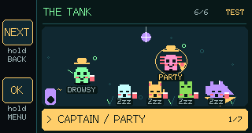
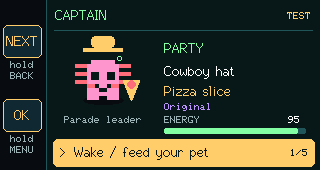

# Breath Pet

A pocket party pet tank for the **LILYGO T-Display-S3**, with a 1.9-inch ST7789 screen. Friends pick a nickname, adopt a pet for the evening, and watch everyone's pets swim around together.






**Feed your pet now uses the real MQ-3 sensor by default. Cup vapor is suitable for setup without drinking. Scores are fictional game units, never BAC.**

## Join the evening

The tank starts empty. Choose **Add Pet**, choose a nickname, then adopt a species. Up to six people can join, one at a time. Existing pets swim freely around a shared aquarium; there are no placeholder pets or individual boxes.

Nicknames include Captain, Goose, Bean, Chaos, Pickle, Nugget, Bubbles, Spud, Mochi, Gremlin, Waffles, Noodle, Goblin, Peach, Squid and Biscuit. Used names are skipped to avoid confusing people's readings. Species are Blob, Axolotl, Bat, Cat, Ghost and Frog.

Choose a swimming pet to see its outfit, personality, one energy meter, and five actions:

- **Wake / feed:** one press starts the five-second GET READY countdown, followed by ten seconds of BLOW. Clean-air readiness is tracked in the background. Only an unsettled signal shows Sensor recovering; the countdown starts automatically once ready, or OK/Back cancels the pending feeding. For cup testing, bring vapor near the dry sensor only at BLOW, then remove it after capture. The highest reading during BLOW sets the reaction; the countdown readings are excluded.
- **History:** that pet's last 16 readings, preserving original source, score, sensor values and old health deltas. Historical damage entries are not rewritten.
- **Take a nap:** put your pet to sleep immediately.
- **Wardrobe:** NEXT chooses hats, hand items, colours or Back; OK cycles the unlocked choices in that category.
- **Play bubble catch:** press OK when the moving bubble is inside the gold zone. Three catches wake the pet without taking a sensor reading. NEXT offers Back.

Every pet's CHILL, PARTY, WILD, DROWSY or ASLEEP state appears beside it in the tank. Pet detail shows its belongings and personality instead of health/food/joy bars. Gameplay uses a reaction meter and game level; raw millivolts remain in the setup screen and USB history diagnostics.

Collections follow the nickname across evenings. **Menu > Start new evening** clears the current roster, readings and evening awards after confirmation, but retains clothes and tank upgrades. **Evening awards** and **Tank upgrades** are also in that menu. Saving keeps existing v2 pet/history data and adds a separate versioned party-state record. Obsolete v1 data is removed only after a valid v2 record has been loaded, to reclaim the board's small save area.

## Two-button controls

| Button | Tap | Hold for 1.2 seconds |
| --- | --- | --- |
| **Upper / BOOT / GPIO0** | NEXT: cycle option, nickname, pet or demo value | Back / cancel |
| **Lower / GPIO14** | OK: choose the highlighted action | Open evening menu |

Hold the device landscape with USB and the two front buttons on the **left**, like the product photo. A fixed left rail labels each physical button; pressing it lights its label. The large gold bar shows exactly what OK will do. Every screen, including the tank and evening menu, uses the same gold selector and option counter (for example, 2/4). NEXT consistently cycles without confirming; OK confirms. On History, NEXT advances the page. A golden ring identifies the selected swimming pet. BOOT during power-up still enters firmware download mode.

In the tank, NEXT cycles through existing pets, Add Pet and Menu. Six is the capacity, not the starting population. Hold the upper button to go back or cancel a sample; hold the lower button for the evening menu.

Touch uses the same flows when a supported controller responds. Firmware probes CST816-family (0x15) and CST328 (0x1A) on SDA18/SCL17, reset21 and interrupt16. **The currently tested board does not respond to either address or the full I2C scan, and the user reports that touch does not work.** Everything is operable with buttons. Screen rendering does not prove touch hardware is present; LILYGO sells both variants.

## Party mechanics and approximate response levels

These are provisional game reactions, not BAC or an estimate of someone's intoxication. In live mode, the MQ-3 continuously maintains a rolling 100-sample window on every screen. The nominal clean-air band is **50-250 mV**, with at most 25 mV spread. When ready, Feed immediately freezes the recent window average as its baseline and starts the countdown. This tracks drift within the nominal band instead of assuming a fixed voltage. After a five-second countdown, the peak from the following ten seconds is used. Early exposure during countdown does not count toward the peak. Navigation does not reset the window. Following exposure, recovery happens while viewing results or browsing; if Feed is requested before recovery, it waits and then automatically starts. Cancelled requests and rejected captures never restart themselves. After power-up or enabling live mode, the first window still takes at least ten seconds to fill.

Peaks below **400 mV** give game level zero. Otherwise, the level is `clamp(max(0, peak_mV - baseline_mV - 20) * 100 / sensor_span_mV, 0, 100)`. The saved default span is 1200 mV; existing custom settings survive upgrades. Menu > Response settings changes this range from 100 to 2000 mV. Demo mode uses the existing fake zero/span calibration and is available for this boot from Change input mode.

- **CHILL (0-24):** gentle swimming and bubble chasing.
- **PARTY (25-69):** faster swimming and more bubbles.
- **WILD (70-100):** zooming, winking, wobbling and sparkling bubbles. No damage.
- **DROWSY:** ten powered minutes without a feeding or completed game.
- **ASLEEP:** twenty powered minutes, or Take a nap; pets settle on the tank floor with closed eyes and Zzz.

Any completed feeding, including a zero-response reading, wakes the pet, restores energy and gives the same food/joy increment. There is no neglect damage or high-reading penalty. Old health/food/joy fields remain for save compatibility and USB diagnostics; energy is the only care bar in the UI. Timers pause while powered off. Five-second feeding and ten-second nap button cooldowns remain.

## Clothes, personalities and shared toys

A feeding or completed bubble game earns at most one rewarded check-in per pet per ten powered minutes. Repeating it can still wake the pet but cannot farm clothes. The reward calculation never uses the sensor level.

- First rewarded check-in: a red cup, automatically equipped.
- Later rewarded check-ins: a random unowned accessory; the third guarantees a hat if any hats remain.
- Hats: party cone, cowboy hat, crown, sunglasses and top hat.
- Hand items: red cup, pizza slice, floatie and bubble wand.
- Return with the same nickname on a second, third and fourth evening to unlock sunshine, lilac and ocean colours. Up to 32 nickname collections are retained.

Personalities are stable by nickname: Goose is a hat prankster, Bean is a shy cup buddy, and Captain leads short parades. Other nicknames get a repeatable personality. Awake pets periodically gather for a shared greeting/parade; the prankster briefly borrows a visual hat without changing anyone's inventory. Friendly encounters accumulate every two powered minutes when at least two pets are awake.

Shared rewarded check-ins unlock a jukebox at two, a pirate ship at five, and a disco ball at eight. If at least two pets have checked in and everyone is awake, an eligible check-in also triggers fifteen seconds of confetti and unlocks the disco ball early. Decorations stay across evenings. Awards compare collectible counts (Best Dressed), naps (Most Naps) and friendly encounters (Social Butterfly); ties are identified on screen. Awards update throughout the evening, so view them before starting a new one.

## Sensor diagnostics

Captures below 20 mV or above 2700 mV, or with fewer than 80 acquired samples, are rejected without history or rewards. Hold Back or Menu to cancel the countdown or capture. These checks cannot identify every wiring fault or prove that breath was provided; the MQ-3 has no airflow detector. Gameplay deliberately accepts a quiet zero-response capture.

Menu > MQ-3 setup shows millivolts and a live trace, with its own temporary baseline independent of feeding. See [MQ3_WIRING.md](MQ3_WIRING.md) for the eight-resistor divider, 5 V supply, GPIO1, conditioning and multimeter checks. Cup tests have demonstrated response/recovery and real history capture; they are not concentration calibration.

## Build and upload

Install Python and Git, clone this repository, then run from its directory:

```powershell
.\dev.ps1 build
.\dev.ps1 upload -Port COM3
.\dev.ps1 monitor -Port COM3
```

The helper creates a local `.venv` on first use. Build products go into `.pio` and compiler downloads into `.cache/platformio`; both are ignored by Git. For an existing environment after pulling changes, run `.venv\Scripts\python.exe -m pip install -r requirements-dev.txt`.

If PowerShell blocks scripts, use `powershell -ExecutionPolicy Bypass -File .\dev.ps1 build` for that invocation. Close the monitor before flashing; Ctrl+C exits it. If upload cannot connect, hold BOOT, press/release RST, release BOOT, and retry. Press RST afterward if needed.

On Linux/macOS, create and activate a Python virtual environment, install `requirements-dev.txt`, then use `pio run` and `pio run -t upload --upload-port <your-port>`.

The build pins `espressif32@6.5.0` / Arduino-ESP32 2.0.14, following LILYGO's working parallel TFT setup. Display power: GPIO15; backlight: GPIO38; buttons: GPIO0/GPIO14. Hardware: 16MB flash, 8MB OPI PSRAM.

## Tests and diagnostics

```powershell
# Temporarily flashes a test build with separate saved data, then restores normal firmware.
.\dev.ps1 test -Port COM3
```

Tests use the separate `breath-test` NVS namespace; your normal pets in `breath-pet` are preserved. The script refuses to reset data unless the test firmware reports `test_mode: true`. The helper restores the normal firmware even when tests fail (leave USB connected). `-ResetDemoData` remains accepted for older scripts but is no longer required.

The device test drives the same navigation handlers as the physical buttons. It checks adoption, taken-name skipping, six-player capacity, timed feeding, cooldowns, owner isolation, high-response reactions, input validation, persistent stats/history and calibration, animation, and new-evening confirmation. The live test uses synthetic ADC values available only in the isolated test build; it checks rolling background baselines, immediate Feed, queued recovery, scoring, source labeling, recovery across owners, cancellation, invalid voltage and persistence. The expanded suite also covers countdown isolation, timed capture, sleep boundaries, zero-response wakeups, rewards, cooldowns, wardrobe controls, mini-game misses and wins, returning nicknames, awards and persistent collections. Separate on-device tests cover old-data migration, stat bounds, timing, score limits and history rollover. Test output is saved to ignored `test-results.json`.

Newline-terminated serial commands at 115200 baud:

```text
status                   selftest                 touchscan
join CAPTAIN 0           select 0                 history
sample 25                rest                     tank
ui next                  ui select                ui back             ui menu
cal zero                 cal default              cal minus           cal plus
night new CONFIRM        screen                   reboot
sensor open              sensor zero              sensor clear
input live               input demo
```

`join` accepts a unique 1–8-character alphanumeric nickname and a species index 0–5. `select` takes an occupied slot 0–5. `sample` accepts fake units 0–100 only in demo mode and observes the selected pet's cooldown. `night new CONFIRM` clears the evening. A `CMD` line precedes each command's reply, separating it from unsolicited status JSON. Automated clients can send `@123 status`: the acknowledgement becomes `CMD 123`, and status/history JSON echoes `request_id: 123`. Unsolicited status has request ID zero. Match IDs before accepting a reply; recover missing replies with a read-only status/history query rather than repeating an action. In live mode, `cal minus`/`cal plus` decrease/increase the span, `cal default` restores 1200 mV, and `cal zero` is rejected because each feeding captures its own baseline.

`screen` exports the actual RGB565 framebuffer, useful for layout QA but not a physical panel readback. For example:

```powershell
.venv\Scripts\python.exe tools\capture_screen.py artifacts\tank.png --command tank
```

## Files and licensing

`src/party.h` holds per-person state, persistence and game rules. `src/main.cpp` handles navigation, input and feeding. `src/ui.h` draws the shared selection UI and screens. `src/mq3.h` handles ADC acquisition, live capture and recovery checks. `src/fun.h` holds sleep, collections, rewards, personalities, group progress and awards. `src/hardware.h` contains the display initialization, button debouncing and touch drivers.

Original code is MIT licensed. TFT_eSPI 2.5.43, TouchLib, the board definition and ST7789 initialization come from [LILYGO's T-Display-S3 repository](https://github.com/Xinyuan-LilyGO/T-Display-S3), commit `ec889e789b3cf093412689a143f7f37b42b56af7`, with vendor licenses retained in `lib/`.

No factory flash dump, local logs or saved player readings are published. LILYGO provides [factory firmware](https://github.com/Xinyuan-LilyGO/T-Display-S3/tree/main/firmware).
