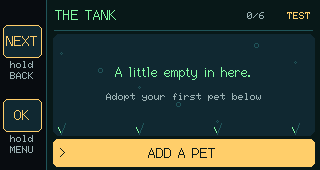
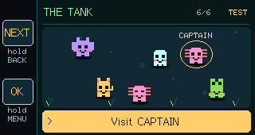

# Breath Pet

A pocket party pet tank for the **LILYGO T-Display-S3**, with a 1.9-inch ST7789 screen. Friends pick a nickname, adopt a pet for the evening, and watch everyone's pets swim around together.





**Feed your pet now uses the real MQ-3 sensor by default. Cup vapor is suitable for setup without drinking. Scores are fictional game units, never BAC.**

## Join the evening

The tank starts empty. Choose **Add Pet**, choose a nickname, then adopt a species. Up to six people can join, one at a time. Existing pets swim freely around a shared aquarium; there are no placeholder pets or individual boxes.

Nicknames include Captain, Goose, Bean, Chaos, Pickle, Nugget, Bubbles, Spud, Mochi, Gremlin, Waffles, Noodle, Goblin, Peach, Squid and Biscuit. Used names are skipped to avoid confusing people's readings. Species are Blob, Axolotl, Bat, Cat, Ghost and Frog.

Choose a swimming pet to open its care screen:

- **Feed:** keep the cup away while a fresh clean-air window settles. Press OK when Start live feed appears, then briefly bring the cup near the sensor. A 12-second sample captures the peak voltage rise for that pet only. Remove the cup after 5–10 seconds and let the sensor recover.
- **History:** that pet's last 16 samples, labeled MQ3 or DEMO, with game score and health change. Measured entries retain baseline, peak and the response scale used.
- **Rest:** recover health without taking a sample.

The roster, species, care stats, calibration and each person's history survive restarts. **Menu → Start a new evening** clears pets and history only after confirmation; Keep pets is selected by default. Calibration settings are retained. The v2 saved-data format migrates existing party pets and readings from v1; those older readings remain labeled DEMO. The solo prototype's data stays unassigned.

## Two-button controls

| Button | Tap | Hold for 1.2 seconds |
| --- | --- | --- |
| **Upper / BOOT / GPIO0** | NEXT: cycle option, nickname, pet or demo value | Back / cancel |
| **Lower / GPIO14** | OK: choose the highlighted action | Open evening menu |

Hold the device landscape with USB and the two front buttons on the **left**, like the product photo. A fixed left rail labels each physical button; pressing it lights its label. The large gold bar shows exactly what OK will do. Every screen, including the tank and evening menu, uses the same gold selector and option counter (for example, 2/4). NEXT consistently cycles without confirming; OK confirms. On History, NEXT advances the page. A golden ring identifies the selected swimming pet. BOOT during power-up still enters firmware download mode.

In the tank, NEXT cycles through existing pets, Add Pet and Menu. Six is the capacity, not the starting population. Hold the upper button to go back or cancel a sample; hold the lower button for the evening menu.

Touch uses the same flows when a supported controller responds. Firmware probes CST816-family (0x15) and CST328 (0x1A) on SDA18/SCL17, reset21 and interrupt16. **The currently tested board does not respond to either address or the full I2C scan, and the user reports that touch does not work.** Everything is operable with buttons. Screen rendering does not prove touch hardware is present; LILYGO sells both variants.

## Game rules — not alcohol units

The provisional clean-air band is **50–250 mV at GPIO1**. A peak of **251–399 mV** is an uncertain response and scores zero; **400 mV or more** enables response scoring. Below 400 mV, a clean-air/weak-response feeding still gives the normal zero-score reward.

At or above 400 mV, live score is `clamp(max(0, peak_mV - baseline_mV - 20) * 100 / sensor_span_mV, 0, 100)`. The default span is now **1200 mV**, twice the previous range, so the same response scores about half as much. For the observed baseline of 139 mV and cup peak of 852 mV, the new score is **57** instead of 100: feeding without damage. With that baseline, overload starts at 999 mV (score 70). The threshold moves with the fresh baseline and response setting; 400 mV is not the overload threshold.

These thresholds are provisional game settings for this sensor/divider setup, not evidence that someone drank or a BAC calibration. The 20 mV allowance suppresses small fluctuations.

Demo mode retains `clamp((fake_input - zero) * 100 / span, 0, 100)`. Demo and live settings are independent.

- Score **0**: +8 food, +6 joy. Anyone can play without alcohol.
- Score **1–69**: +15 food, +12 joy; the reward is capped across this range.
- Score **70–100**: overload; +3 food, −12 joy, and health damage `10 + floor((score - 70) / 2)`.
- Stats stay within 0–100. Rest adds up to 8 health and 4 joy, and clears the overload expression.
- Each pet has a five-second feeding cooldown and ten-second rest cooldown to prevent repeat-button accidents.
- While powered, food and joy decay by one per minute; an empty food meter also costs one health. There is no offline decay.

Menu → Response settings adjusts live span from 100–2000 mV in 100 mV steps, or restores 1200 mV. More responsive reduces span; less responsive increases it. Existing saved settings survive firmware updates; choose Default to apply the new 1200 mV scale. Earlier records retain their original scale and result. Menu → Change input mode toggles live/demo for the current boot; normal firmware boots into live mode. In demo mode, Response settings retains the fake zero/span controls (25–200).

Samples carry a global sequence number plus boot number and seconds since that boot. These are session labels, not wall-clock timestamps. No Wi-Fi, network account, or external service is involved in gameplay.

## Live feeding and recovery

1. Choose a pet and Feed your pet. Keep the cup away in clean air.
2. The screen collects a fresh 100-sample window (at least ten seconds). Every sample must be between 50 and 250 mV, with a window spread no greater than 25 mV.
3. When ready, press OK, then bring cup vapor near the dry sensor for 5–10 seconds. The full capture lasts 12 seconds; its fresh-air baseline stays frozen.
4. The peak rise determines the game score. A clean-air capture with no rise gives a score of zero and still feeds the pet; alcohol is not required.
5. Remove the cup. The next feeding waits for another full quiet window in the 50–250 mV clean-air band. This applies to every pet, including after cancelling, and allows normal baseline drift within that band. Recovery may take a minute or longer.

Holding Back or Menu cancels without a history entry. Readings below 20 mV or above 2700 mV during capture, or fewer than 80 acquired samples, reject the capture without changing pet stats. These checks cannot detect every wiring fault. Fresh air must actually be clean air; a stable alcohol plume cannot be automatically identified as a bad baseline. The fresh clean-air window is required after power-up too; a stable reading above 250 mV cannot start a feeding.

**Menu → MQ-3 setup** remains a live-voltage bench monitor with its own temporary zero, independent of feeding. The hardware cup test observed about 107 mV in clean air, 414 mV after sake exposure, and 106 mV after removal. This is qualitative response/recovery evidence; it is not concentration calibration.

The module is the [ACEIRMC MQ-3 board](https://www.amazon.com/dp/B0978KZQVY). See [MQ3_WIRING.md](MQ3_WIRING.md) for eight 2 kΩ resistors, 5 V power, GPIO1 and multimeter checks. Initial sensor conditioning and repeatability still matter; this prototype never reports BAC.

## Build and upload

Install Python and Git, clone this repository, then run from its directory:

```powershell
.\dev.ps1 build
.\dev.ps1 upload -Port COM3
.\dev.ps1 monitor -Port COM3
```

The helper creates a local `.venv` on first use. Build products go into `.pio` and compiler downloads into `.cache/platformio`; both are ignored by Git. For an existing environment after pulling changes, run `.venv\Scripts\python.exe -m pip install -r requirements-dev.txt`.

If PowerShell blocks scripts, use `powershell -ExecutionPolicy Bypass -File .\dev.ps1 build` for that invocation. Close the monitor before flashing; Ctrl+C exits it. If upload cannot connect, hold BOOT, press/release RST, release BOOT, and retry. Press RST afterward if needed.

On Linux/macOS, create and activate a Python virtual environment, install `requirements-dev.txt`, then use `pio run` and `pio run -t upload --upload-port <your-port>`.

The build pins `espressif32@6.5.0` / Arduino-ESP32 2.0.14, following LILYGO's working parallel TFT setup. Display power: GPIO15; backlight: GPIO38; buttons: GPIO0/GPIO14. Hardware: 16MB flash, 8MB OPI PSRAM.

## Tests and diagnostics

```powershell
# Temporarily flashes a test build with separate saved data, then restores normal firmware.
.\dev.ps1 test -Port COM3
```

Tests use the separate `breath-test` NVS namespace; your normal pets in `breath-pet` are preserved. The script refuses to reset data unless the test firmware reports `test_mode: true`. The helper restores the normal firmware even when tests fail (leave USB connected). `-ResetDemoData` remains accepted for older scripts but is no longer required.

The device test drives the same navigation handlers as the physical buttons. It checks adoption, taken-name skipping, six-player capacity, timed feeding, cooldowns, owner isolation, overload/recovery, input validation, persistent stats/history and calibration, animation, and new-evening confirmation. The live test uses synthetic ADC values available only in the isolated test build; it checks fresh baselines, scoring, source labeling, recovery across owners, cancellation, invalid voltage and persistence. Separate on-device tests cover old-data migration, stat bounds, timing, score limits and history rollover. Test output is saved to ignored `test-results.json`.

Newline-terminated serial commands at 115200 baud:

```text
status                   selftest                 touchscan
join CAPTAIN 0           select 0                 history
sample 25                rest                     tank
ui next                  ui select                ui back             ui menu
cal zero                 cal default              cal minus           cal plus
night new CONFIRM        screen                   reboot
sensor open              sensor zero              sensor clear
input live               input demo
```

`join` accepts a unique 1–8-character alphanumeric nickname and a species index 0–5. `select` takes an occupied slot 0–5. `sample` accepts fake units 0–100 only in demo mode and observes the selected pet's cooldown. `night new CONFIRM` clears the evening. A `CMD` line precedes each command's reply, separating it from unsolicited status JSON. Automated clients can send `@123 status`: the acknowledgement becomes `CMD 123`, and status/history JSON echoes `request_id: 123`. Unsolicited status has request ID zero. Match IDs before accepting a reply; recover missing replies with a read-only status/history query rather than repeating an action. In live mode, `cal minus`/`cal plus` decrease/increase the span, `cal default` restores 1200 mV, and `cal zero` is rejected because each feeding captures its own baseline.

`screen` exports the actual RGB565 framebuffer, useful for layout QA but not a physical panel readback. For example:

```powershell
.venv\Scripts\python.exe tools\capture_screen.py artifacts\tank.png --command tank
```

## Files and licensing

`src/party.h` holds per-person state, persistence and game rules. `src/main.cpp` handles navigation, input and feeding. `src/ui.h` draws the shared selection UI and screens. `src/mq3.h` handles ADC acquisition, live capture and recovery checks. `src/hardware.h` contains the display initialization, button debouncing and touch drivers.

Original code is MIT licensed. TFT_eSPI 2.5.43, TouchLib, the board definition and ST7789 initialization come from [LILYGO's T-Display-S3 repository](https://github.com/Xinyuan-LilyGO/T-Display-S3), commit `ec889e789b3cf093412689a143f7f37b42b56af7`, with vendor licenses retained in `lib/`.

No factory flash dump, local logs or saved player readings are published. LILYGO provides [factory firmware](https://github.com/Xinyuan-LilyGO/T-Display-S3/tree/main/firmware).
