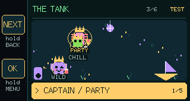
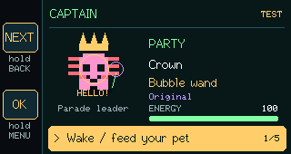
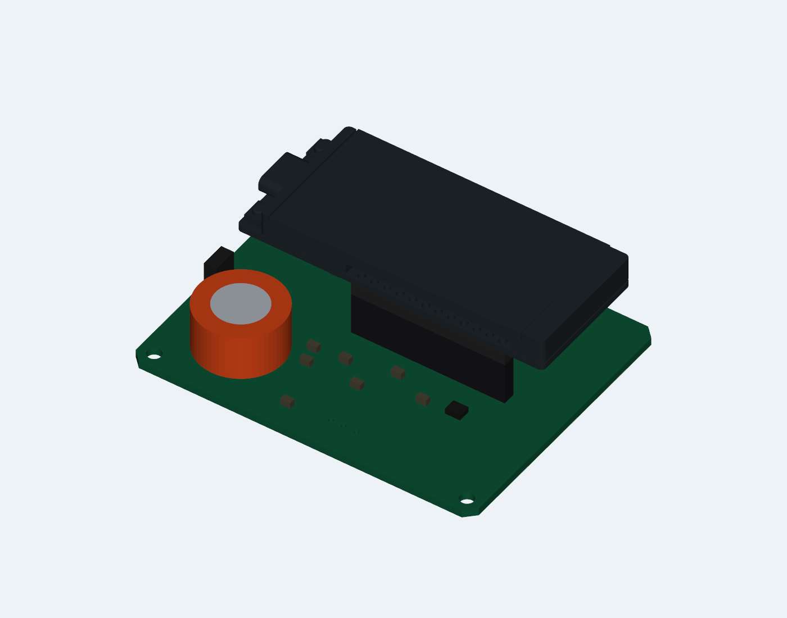

# Breath Pet

A pocket party aquarium for the **LILYGO T-Display-S3**. Pick a nickname, adopt a pet, and watch everyone's creatures swim around together. Wake them with an MQ-3 sample or a quick bubble game, collect silly outfits, and decorate the shared tank.

| The shared tank | Your pet and its belongings |
| --- | --- |
|  |  |

**MQ-3 readings produce fictional game levels, not BAC or an estimate of intoxication.** A cup-vapor test works for setup without drinking. Clothes and rewards do not depend on getting a higher reading.

## Start playing

1. Hold the board landscape with **USB and the two front buttons on the left**.
2. Select **Add a pet**, pick a nickname, then a species. The tank starts empty and holds up to six pets.
3. Select your pet. **Wake / feed** starts a **5-second countdown**, then **10 seconds of BLOW**. Only the highest reading during BLOW determines the game reaction.
4. Watch its state in the tank, or open its detail page for History, Take a nap, Wardrobe and Play bubble catch.

Clean air is monitored in the background. Feed starts immediately when the signal is settled; **Sensor recovering** appears only if it needs more time. It starts the countdown automatically once ready, or you can cancel. The first window after power-up takes at least ten seconds. For cup testing, bring vapor near the dry sensor at BLOW and remove it when capture finishes.

| Physical button | Tap | Hold 1.2 seconds |
| --- | --- | --- |
| **Upper / BOOT / GPIO0** | NEXT: cycle the selection | Back / cancel |
| **Lower / GPIO14** | OK: choose the gold action | Evening menu |

The left rail corresponds to the physical buttons. Every selectable page uses the same gold action bar. During countdown and BLOW, taps are disabled; holds still cancel or open the menu. No touch controller was detected on the tested board; both buttons are sufficient. LILYGO sells standard and touch variants. Touch-controller support exists in firmware but has not been verified on touch hardware.

## What the pets do

- **CHILL, PARTY and WILD** change swimming and expressions. High readings cause no damage.
- After **10 powered minutes** without feeding or a completed game, pets become DROWSY; after **20**, they fall ASLEEP. Any completed sample, even level zero, or a three-catch game wakes them. There is one energy meter.
- Check in to find red cups, hats and other accessories, with at most one rewarded check-in per pet per ten powered minutes. Clothes and colours are collected during the current evening.
- Everyone contributes to a jukebox, pirate ship and disco ball. View Best Dressed, Most Naps and Social Butterfly in Evening awards.
- **Start new evening** asks for confirmation, then clears pets, readings, clothes, colours, awards progress and shared decorations. Sensor settings stay saved.

See the [gameplay guide](docs/GAMEPLAY.md) for reactions, rewards, persistence and all menu options, or browse the [current screen gallery](docs/screenshots/README.md).

## Wire the sensor

Use the module's **5 V supply, common ground, and AO through an equal-resistance voltage divider to GPIO1**. Eight 2 kΩ resistors make two 8 kΩ chains. Leave DO disconnected. Do not connect a 5 V output directly to the ESP32.

Follow the [wiring diagram and meter checks](MQ3_WIRING.md) before connecting the ADC input. **MQ-3 setup** retains the millivolt trace for diagnostics; normal play shows game levels and a response bar. Response settings adjust game sensitivity, not BAC calibration. Normal firmware boots in LIVE mode; Menu > Change input mode enables DEMO for the current boot.

## Custom PCB and printable case

[Rev A hardware](hardware/README.md) replaces the breadboard with a socketed LILYGO carrier and a directly mounted MQ-3. It includes editable KiCad files, a Gerber ZIP, JLCPCB BOM/CPL preparation, STEP models, and Ender 3 case/fit-gauge STLs. **This is an unbuilt prototype:** CAD checks pass, but the actual sensor variant, printed fit and powered behavior still need verification. The case is optional.

**The first PCB/case layout is on hold for a proportions revision.** Its sensor envelope was assumed and the carrier is oversized. Follow the hardware guide's sizing status before ordering or printing.



## Build and upload

With Python and Git installed, run in PowerShell:

```powershell
git clone https://github.com/JohnLHolloway/breath-pet.git
cd breath-pet
.\dev.ps1 build
.\dev.ps1 upload -Port COM3
```

The helper creates a local Python environment and installs development tools. Replace COM3 with your board's port. Close any serial monitor before uploading. If connection fails, hold BOOT, press and release RST, release BOOT, then retry the upload.

[Development instructions](docs/DEVELOPMENT.md) cover other platforms, dependencies, serial commands, isolated device tests and screenshot capture. [Hardware verification](HARDWARE_TEST.md) records the tested board, the 105-check suite and what remains physically unverified.

## Screenshots and licensing

The gallery contains **actual 320 × 170 framebuffers exported by the ESP32**, using fictional pets and synthetic sensor inputs in isolated test firmware. TEST means test firmware, not a real person's reading. They are not photographs or a physical panel readback. The gallery includes a reproducible capture tool and a hash manifest.

Original code is MIT licensed. TFT_eSPI 2.5.43, TouchLib, the board definition and display initialization come from [LILYGO's T-Display-S3 repository](https://github.com/Xinyuan-LilyGO/T-Display-S3), commit `ec889e789b3cf093412689a143f7f37b42b56af7`; vendor licenses remain in `lib/`. LILYGO provides [factory firmware](https://github.com/Xinyuan-LilyGO/T-Display-S3/tree/main/firmware). No factory flash dump or private player readings are included.
