# Current screen gallery

[Project home](../../README.md) · [Gameplay](../GAMEPLAY.md) · [Wiring](../../MQ3_WIRING.md) · [Capture instructions](../DEVELOPMENT.md#screenshots)

Captured **2026-09-22** from firmware **version 7** on the LILYGO T-Display-S3. These are native **320 × 170 ESP32 framebuffer exports**, not photos or panel readback. The fixtures use fictional Captain, Goose and Bean pets in separate test storage. **TEST means isolated firmware; every sensor reading in this gallery is synthetic, including entries labeled MQ3.** Normal firmware instead labels its mode LIVE or DEMO.

The same left-side NEXT/OK rail and gold action bar are used throughout. Hold the upper button for Back and the lower for Menu. The gallery replaces older screenshots of the previous menus and multiple care bars.

The [capture manifest](manifest.json) records the source revision, firmware hash and image hashes. Regenerate it with `tools/capture_gallery.py` from the repository root; that script restores normal firmware and checks saved data before publishing images. Animation positions and randomly awarded accessories can differ on another run.

## Join an evening

| An empty evening: add pets one at a time. | Choose an unused nickname. |
| --- | --- |
| 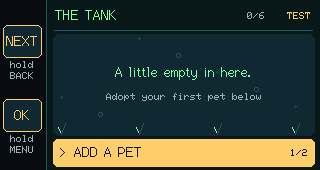 | 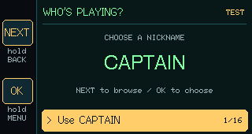 |

| Choose one of six species. | Optional DEMO picker; normal firmware starts in LIVE mode. |
| --- | --- |
| 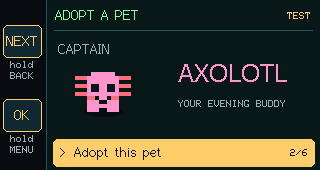 | 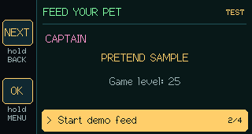 |

## Pets in the shared tank

| Three pets swim freely with reactions, accessories and shared decorations. | PARTY, DROWSY and sleeping pets share the same tank. |
| --- | --- |
|  | 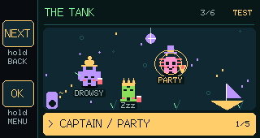 |

| Pet detail: personality, equipped belongings and one energy meter. | Cycle unlocked hats, hand items and colours. |
| --- | --- |
|  | 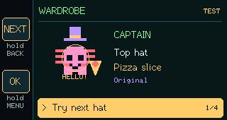 |

## Wake and play

| Catch three bubbles in the gold zone to wake your pet. | Five seconds to get ready; the peak window has not started. |
| --- | --- |
| 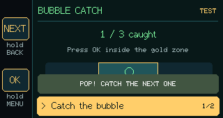 | 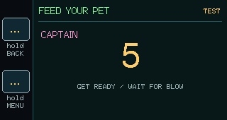 |

| Ten seconds of BLOW with a game-response meter, using injected 850 mV. | Level 60 / PARTY from the synthetic MQ-3 capture; this is not BAC. |
| --- | --- |
| 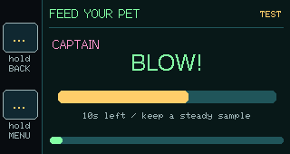 | 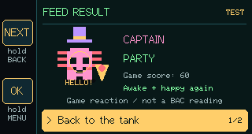 |

## Readings and controls

| Per-pet readings show level and source; older DEMO samples stay labeled. | Recovery appears only when Feed is requested before the signal settles. |
| --- | --- |
| 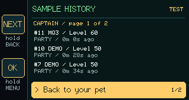 | 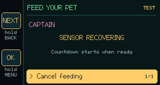 |

| The evening menu uses the same selector and physical-button labels. | Adjust game sensitivity; these settings do not calibrate BAC. |
| --- | --- |
| 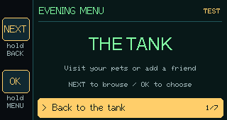 | 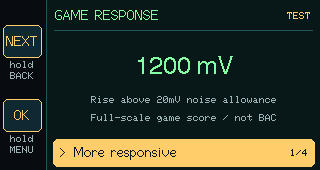 |

## Setup and evening progress

| Bench diagnostics retain millivolts and a trace; this fixture injects 100 mV. | Evening awards summarize clothing, naps and friendly encounters. |
| --- | --- |
| 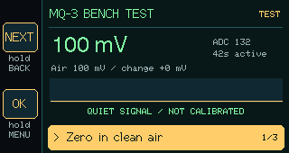 | 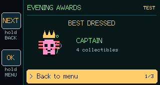 |

| Shared decorations last for this evening and reset with a new one. | Keep is the default; resetting clears pets, readings, clothes and decorations. |
| --- | --- |
| 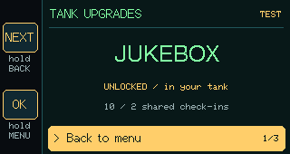 | 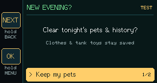 |
