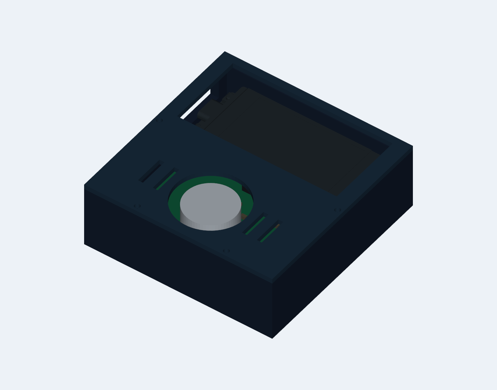

# Breath Pet carrier PCB — Rev A prototype

A **68 × 70 mm, two-layer carrier** for the LILYGO T-Display-S3, with a bare MQ-3 soldered directly beside it. The LILYGO plugs into two female sockets. A replacement printed case is optional; the carrier can be tested on insulated standoffs with no case.

**Status: CAD-checked, not yet manufactured or bench-tested.** Check the actual sensor and print the fit gauges before ordering. These files are a prototype release, not a claim that an assembled board has passed testing. The original breadboard and firmware are unchanged.

| Direct-sensor PCB assembly | Optional printed case |
| --- | --- |
|  |  |

The pictures are renders of the supplied CAD. The display uses LILYGO's model; the sensor, sockets and small components are dimensional envelopes. Copper and silkscreen are shown separately in the PCB previews. The sensor mesh, actual socket contacts and screws are not modeled.

## Files to use

| Purpose | File |
| --- | --- |
| Editable design | [KiCad project](rev-a/carrier.kicad_pro), [PCB](rev-a/carrier.kicad_pcb), [schematic](rev-a/carrier.kicad_sch) |
| Circuit review | [Schematic SVG](rev-a/previews/carrier.svg) |
| Layout review | [Top](rev-a/previews/pcb-top.svg), [bottom, viewed through board](rev-a/previews/pcb-bottom.svg) |
| Independent Gerber readback | [Top copper/drills/silk](rev-a/previews/gerber-top.svg), [bottom copper/drills/silk, viewed through board](rev-a/previews/gerber-bottom.svg) |
| PCB fabrication | [Gerber + drill ZIP](rev-a/manufacturing/breath-pet-rev-a-gerbers.zip) |
| JLCPCB assembly preparation | [BOM](rev-a/manufacturing/jlc-bom-direct.csv), [CPL](rev-a/manufacturing/jlc-cpl-direct.csv), [ordering instructions](rev-a/manufacturing/README.md) |
| Parts to solder yourself | [Hand-assembly list](rev-a/manufacturing/hand-assembly.csv) |
| Check fit first | [Header gauge STL](rev-a/mechanical/header-fit-gauge.stl), [sensor gauge STL](rev-a/mechanical/sensor-fit-gauge.stl) |
| Ender 3 case | [Base STL](rev-a/mechanical/case-base.stl), [cover STL](rev-a/mechanical/case-cover.stl) |
| CAD editing | [Electronics STEP](rev-a/mechanical/electronics-assembly.step), [case assembly STEP](rev-a/mechanical/case-assembly.step), [parametric generator](tools/build_mechanical.py) |

## What is on the board

- **J1/J2:** two 1×12, 2.54 mm sockets, with rows 22.86 mm apart. Viewed from above with the display up and USB left, J1/P1 is the upper row, J2/P2 the lower row. Pin 1 is nearest USB. This orientation was cross-checked against the vendor schematic, pinout, STEP and shield drawing.
- **S1:** six-hole classic MQ sensor footprint, 9.5 mm pin circle with A/B electrodes at 45°. Holes are 1.2 mm, pads 2.4 mm. The courtyard allows a 20 mm can. Verify the actual donor; the name “MQ-3” alone does not establish compatibility.
- **JP1:** removable sensor-power shunt. Remove it for troubleshooting; fit it for normal operation.
- **R1/R2/R3/C1:** half-voltage divider, series resistor and filter feeding **GPIO1**. This preserves the firmware's ADC pin and nominal 1:2 voltage scale.
- **R4:** sensor load option. Its fitted value depends on the sensor variant, as below.
- **D1:** BAT54S rail clamp. **C2/C3:** 5 V sensor decoupling.
- **TP5/TP6/TP7/TP8:** accessible ADC, ground, sensor 5 V and raw sensor-output test pads. TP1–TP4 duplicate those nets under the display area.
- **J3:** optional JST-XH 3-pin module connector, **not populated in the direct-sensor build**. It is an alternative assembly, not a live input selector.

Only J2 pins 1 (5 V), 2 (GND), 11 (GPIO1) and 12 (3V3) are connected. J1 and the unused J2 pads are intentionally isolated. The board keeps copper, pads and vias away from the LILYGO antenna area. Three M2.5 mounting holes avoid that area.

## Sensor choice and load resistor

**Keep the working breadboard module intact; use a spare for the donor.** Before removing its can, record its markings and measure the header/pin geometry. Identify the heater pair and the two internally connected electrode pairs with an unpowered meter. For the classic footprint, the heater pair goes across the center and the duplicated electrodes occupy the upper/lower positions on either side. A/B groups can swap, and the heater has no polarity; rotating the heater pair onto an electrode position is not acceptable.

Datasheets marketed as MQ-3 differ substantially. The Winsen MQ-3 manual plots a low-resistance circuit with a 4.7 kΩ load, while the older Hanwei manual specifies a 200 kΩ load. The supplied board can be populated for either starting point, but **the default BOM is the low-resistance variant**. A matching package does not identify the electrical version.

| Assembly / starting point | R1 / R2 | R4 | Effective load on sensor | Notes |
| --- | --- | --- | --- | --- |
| Direct can, low-resistance variant; default BOM | 8.2 kΩ each, 1% | 6.65 kΩ, 1% | 6.65 kΩ ∥ 16.4 kΩ = **4.73 kΩ** | Confirm actual sensor fits this response range |
| Direct can requiring the older 200 kΩ load | 100 kΩ each, 1% | Not fitted | **200 kΩ** | Different BOM; higher source impedance requires an ADC/meter comparison; not qualified by this release |
| Original complete MQ-3 module via cable | 8.2 kΩ each, 1% | Not fitted | Module's own load ∥ 16.4 kΩ | **S1 must not be fitted**; populate J3 instead |

R3 remains 1 kΩ and C1 remains 100 nF. The passive filter reservoir helps the ADC sample a relatively slow signal; it is not a precision buffered analog front end. For the high-impedance variant, clamp leakage and ADC loading can be more significant. Qualify that variant separately or add a buffer in a later revision.

If the spare's construction or load is unknown, compare the donor module's actual load resistor and cup response first. Resistor values are easy to change; don't assume the current 250/400 mV game settings transfer to a new can. The firmware's clean-air window is currently 50–250 mV with a settled signal. Use diagnostics to characterize the new hardware, then adjust the firmware's readiness limits if necessary. “Re-baseline” alone cannot fix a sensor that falls outside that window.

To salvage a can, clear all six solder joints with a pump/wick before lifting it. Avoid pulling against a pin that is still soldered. If necessary sacrifice the inexpensive donor PCB rather than the can's leads. Minimize repeated heating, keep flux/cleaner out of the mesh, and test the recovered heater and electrode continuity again. Desoldering may damage the sensor; a new bare, specified sensor avoids that uncertainty. Follow the actual manufacturer's soldering limits. **The metal mesh remains open to air; no liquid goes onto the sensor.**

## Power and analog checks

Rev A is **USB-powered**. It uses the LILYGO 5 V header rail for the heater; it does not add a battery boost converter. Allow roughly 0.2 A for the sensor alone, plus the display/ESP32. Use a sound 5 V USB supply and cable with enough current headroom; measure heater voltage under load against the sensor's specification. A USB battery bank is an option only after checking regulation and auto-shutoff behavior.

With 1% R1/R2, the unloaded divider ratio lies between 0.495 and 0.505. At a 5.25 V raw input, the divider is at most about **2.65 V**. R3 and C1 give approximately 0.51 ms nominal RC in the default build. The BAT54S is supplemental protection, not permission to feed external voltage into an unpowered board or tolerate a missing divider resistor. It cannot make a 5 V pin safe by itself.

Before first power, inspect assembly and verify that 5 V, 3V3 and ground are not shorted. Confirm R1/R2 values and diode orientation. Power only through the LILYGO USB connection. Check TP7 against TP6, then TP8 and TP5: ADC should track approximately half the raw output. If TP5 approaches 3.3 V, disconnect and investigate. Do not use the GPIO as the first check of an unknown external signal.

Condition a new sensor according to its own manual, warm it consistently, and establish a clean-air reading. Repeat cup exposure and recovery through the existing five-second countdown / ten-second capture. Record raw AO, ADC and recovery; keep temperature and distance reasonably consistent. This is **relative gas-response testing, not BAC calibration**.

## Ender 3 printing and assembly

1. Print **both fit gauges first**, flat at 100% scale in mm. The header gauge is 68 × 32 × 1.2 mm; its notch marks the USB side. The sensor gauge is about 24 mm across and 1.2 mm thick; its notch marks the heater axis. Check pitch gently without forcing pins. Printed-hole shrinkage is possible: distinguish a tight hole from incorrect spacing.
2. Check socket height. CAD assumes an **8.5 mm female socket body plus 2.54 mm male-header spacer**. The LILYGO rear surface is 12.64 mm above the carrier underside. A different stack requires changing the case generator. The existing factory case is not used.
3. Print the base upright on its flat bottom and the cover flat, **0.2 mm layers, 3–4 walls, about 20% infill**, supports off. The footprint is **76 × 78 mm**, overall closed height 27 mm. All openings are vertical; the USB slot is open to the top during printing. A small brim is optional for adhesion.
4. PLA is useful for a fit-only trial. Use a suitable heat-tolerant printing material for operation, and **measure the warmed sensor/nearby plastic temperature before leaving it enclosed**. PETG is a practical candidate on an appropriately configured Ender 3, not a thermal qualification. Do the first powered checks caseless.
5. Solder small parts first, then sockets, power jumper and sensor. Use the unpowered LILYGO as an alignment jig only if needed; avoid letting solder flow into sockets. Leave about 2 mm below the sensor body for airflow, within the assumed 19 mm total height above the PCB. Install the carrier on three short M2.5 screws, then plug in the display. The cover uses four M2 screws; pilot holes may need cleanup for your printer and screw type. Stop if plastic splits or a screw bottoms out.

The wide screen opening exposes both real buttons; no printed button linkage is required. The 28 mm sensor opening and extra vents leave breathing space. This is an **open, vented enclosure**, not a splashproof bar product or a mouthpiece. A later case can add a replaceable splash baffle once airflow and heat have been measured.

## Verification and remaining work

KiCad 10.0.6 reported **zero ERC violations, zero DRC violations, zero unrouted connections, and zero schematic/PCB parity issues** with the saved design rules. A separate netlist check verifies all seven functional nets. Eight SMT placements and the manufacturing ZIP were checked. Independent Gerber/Excellon parsing checks the outline and 33 critical hole positions. CadQuery validates each printable part as a single solid and reports no nominal electronics/case intersections; all four STL meshes have no boundary or non-manifold edges. Reports are in [rev-a/checks](rev-a/checks).

These checks do not verify the donor sensor, soldering, actual header tolerances, JLC part matching, printed screw fits, heater temperature, airflow, power stability, or gas response. No custom PCB has been manufactured or powered. No order has been submitted. The firmware's existing 99-device-check result belongs to the original breadboard setup, not this PCB.

The next physical steps are: identify the spare can, print and check gauges, select the load-resistor variant, review JLC's matched parts/placement preview, build a small prototype batch, then run meter, cup-response and heat checks. Battery operation and a more sealed case are later revisions.

## Rebuild / edit

Open `rev-a/carrier.kicad_pro` in KiCad 10. The project includes local symbol and footprint libraries. **The Python generators overwrite the native design**; edit the generator when reproducing this release, or preserve native GUI edits separately.

```powershell
# Replace with your KiCad 10 installation paths.
& 'C:\Program Files\KiCad\10.0\bin\python.exe' hardware\tools\build_carrier.py
python hardware\tools\build_schematic.py
python hardware\tools\export_manufacturing.py --kicad-cli 'C:\Program Files\KiCad\10.0\bin\kicad-cli.exe'
# In an environment with cadquery==2.8.0 and vtk==9.6.2:
python hardware\tools\build_mechanical.py
# With gerbonara==1.6.3 and vtk==9.6.2:
python hardware\tools\verify_exports.py
```

The PCB generator uses KiCad's `pcbnew` module. Other scripts use normal Python; mechanical generation additionally needs CadQuery and VTK. The export script stops on failed KiCad checks or netlist/export assertions. It does not contact a manufacturer.

[Sources and licensing](SOURCES.md) document reference geometry, footprints, manufacturer manuals and manufacturing formats.
